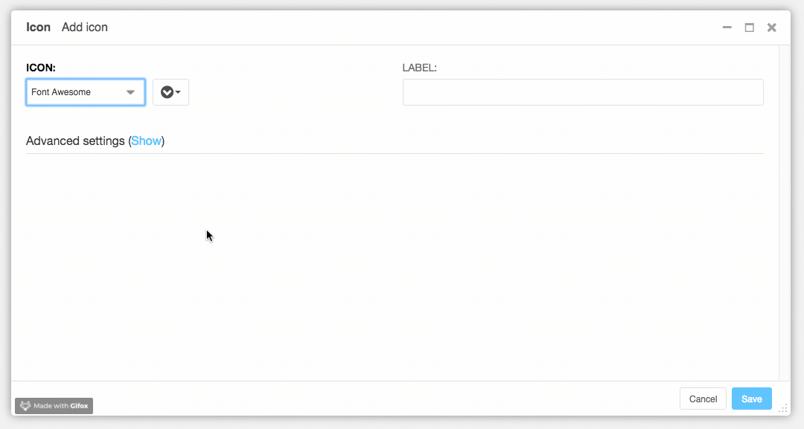

===============
django CMS Icon
===============

|pypi| |coverage| |python| |django| |djangocms|

**django CMS Icon** is a plugin for `django CMS <http://django-cms.org>`_
that allows you to insert an icon (font or svg) into your project.

.. note::

        This project is endorsed by the `django CMS Association <https://www.django-cms.org/en/about-us/>`_.
        That means that it is officially accepted by the dCA as being in line with our roadmap vision and development/plugin policy.
        Join us on `Slack <https://www.django-cms.org/slack/>`_.

*******************************************
Contribute to this project and win rewards
*******************************************

Because this is a an open-source project, we welcome everyone to
`get involved in the project <https://www.django-cms.org/en/contribute/>`_ and
`receive a reward <https://www.django-cms.org/en/bounty-program/>`_ for their contribution.
Become part of a fantastic community and help us make django CMS the best CMS in the world.

We'll be delighted to receive your
feedback in the form of issues and pull requests. Before submitting your
pull request, please review our `contribution guidelines
<http://docs.django-cms.org/en/latest/contributing/index.html>`_.

We're grateful to all contributors who have helped create and maintain this package.
Contributors are listed at the `contributors <https://github.com/django-cms/djangocms-icon/graphs/contributors>`_
section.

Installation
------------

For a manual install:

* run ``pip install djangocms-icon``
* add ``djangocms_icon`` to your ``INSTALLED_APPS``
* run ``python manage.py migrate djangocms_icon``

**A note about django CMS Text CKEditor**

There are additional steps required for the icon plugin to display correctly
inside CKEditor.

1. You need to make sure your icon CSS is passed via CKEditors ``contentsCss``
`parameter <https://github.com/divio/djangocms-text-ckeditor/blob/175a1a444de8ca1ba4742196cb83150d45b5c505/aldryn_config.py#L36>`_.
On Divio Cloud this can be done through the Addons configuration.

2. CKEditor automatically removes empty tags, you can prevent this by adding
a `javascript configuration file <https://github.com/divio/djangocms-boilerplate-webpack/blob/master/static/js/addons/ckeditor.wysiwyg.js#L68>`_
to ``style_set``.

django CMS Icon does not add the styles or javascript files to your frontend, these need to be added at your discretion.

Configuration
-------------

This addon provides a ``default`` template for all instances. You can provide
additional template choices by adding a ``DJANGOCMS_ICON_TEMPLATES``
setting::

    DJANGOCMS_ICON_TEMPLATES = [
        ('svg', 'SVG template'),
    ]

Web Font Icons
##############

The django CMS Icon plugin ships with **Font Awesome 5 as default**. This can
be changed by overriding the following setting::

    DJANGOCMS_ICON_SETS = [
        ('fontawesome5regular', 'far', 'Font Awesome 5 Regular', 'lastest'),
        ('fontawesome5solid', 'fas', 'Font Awesome 5 Solid', 'lastest'),
        ('fontawesome5brands', 'fab', 'Font Awesome 5 Brands', 'lastest'),
    ]

In addition **you need to load** the resources for your fonts in
``/admin/djangocms_icon/includes/assets.html``. Add this file to your project
in order for the icon picker to pick up your custom icons in the admin.

The icon picker supports `numerous font libraries <http://victor-valencia.github.io/bootstrap-iconpicker/>`_
out of the box. You can also add multiple font sets like this::

    DJANGOCMS_ICON_SETS = [
        ('elusiveicon', 'el', 'Elusive Icons'),
        ('flagicon', 'flag-icon', 'Flag Icons'),
        ('fontawesome5regular', 'far', 'Font Awesome 5 Regular'),
        ('fontawesome5solid', 'fas', 'Font Awesome 5 Solid'),
        ('fontawesome5brands', 'fab', 'Font Awesome 5 Brands'),
        ('fontawesome5light', 'fal', 'Font Awesome 5 Light', '5.3.1_pro'),
        ('glyphicon', 'glyphicon', 'Glyphicons'),
        ('ionicon', 'ion', 'Ionicons Icons'),
        ('mapicon', 'map-icon', 'Map Icons'),
        ('materialdesign', 'zmdi', 'Material Design'),
        ('octicon', 'octicon', 'Octicons'),
        ('typicon', 'typcn', 'Typicons'),
        ('weathericon', 'wi', 'Weather Icons'),
    ]

You can also add the version number as a fourth parameter.
If no parameter is given the latest version of the bootstrap-iconpicker icon set is used.::

    DJANGOCMS_ICON_SETS = [
        ('fontawesome4', 'fa', 'Font Awesome 4', '4.0.0'),
        ('fontawesome5light', 'fal', 'Font Awesome 5 Light', '5.3.1_pro'),
    ]

Just don't forget to include both libraries in the ``assets.html`` file.
This is only necessary for the plugin rendering while selecting the icon.
You still need to implement the font libraries into your frontend stack.

Custom Web Font Icons
#####################

You can also add your own custom web fonts, for this you need to tell the
icon picker where to find the necessary files::

    DJANGOCMS_ICON_SETS = [
        (ICONSET, 'icon', 'Custom web font'),
    ]

In this example, we add our own font icon set on top of it. Please mind
that the second parameter needs to be the icon prefix. ``ICONSET`` is an
external reference to a JSON file at the root of your project setting up
your custom font icons, add this before::

    with open('iconset.json') as fh:
        ICONSET = fh.read()

Here an example of its content::

    {
        "iconClass": "icon",
        "icons": [
            "icon-icon1",
            "icon-icon2",
            "..."
        ]
    }

The ``iconClass`` refers to the second parameter in the settings file for the
icon prefix. Make sure both of them are the same. Instead of using an external
file you can also write the settings directly to the ``DJANGOCMS_ICON_SETS``
setting.

`djangocms-boilerplate-webpack <https://github.com/divio/djangocms-boilerplate-webpack/blob/master/tools/tasks/icons/json.js>`_
can generate the ``iconset.json`` automatically for you through ``gulp icons``.

Make sure the icons names contain the iconset prefix as shown in the example,
the widget will determine the iconset based on that. They can be omitted if only
one iconset is used.

Don't forget to also add your custom fonts to
``/admin/djangocms_icon/includes/assets.html`` into your project.

SVG Icons
#########

django CMS Icon also supports SVG icons. Follow the instructions from
`Custom Web Font Icons`_ and then adapt the JSON file a bit::

    {
        "svg": true,
        "spritePath": "sprites/icons.svg",
        "iconClass": "icon",
        "icons": [
            "icon-icon1",
            "icon-icon2",
            "..."
        ]
    }

``svg`` and ``spritePath`` are the only required additional properties. You
also need to add an icon template to your project to render it correctly,
for example::

    
        <svg role="presentation">
            <use xlink:href="#{{ instance.icon }}"></use>
        </svg>
    

Running Tests
-------------

You can run tests by executing::

    virtualenv env
    source env/bin/activate
    pip install -r tests/requirements.txt
    python setup.py test

.. |pypi| image:: https://badge.fury.io/py/djangocms-icon.svg
    :target: http://badge.fury.io/py/djangocms-icon
.. |coverage| image:: https://codecov.io/gh/django-cms/djangocms-icon/branch/master/graph/badge.svg
    :target: https://codecov.io/gh/django-cms/djangocms-icon

.. |python| image:: https://img.shields.io/badge/python-3.8+-blue.svg
    :target: https://pypi.org/project/djangocms-icon/
.. |django| image:: https://img.shields.io/badge/django-3.2,%204.0-blue.svg
    :target: https://www.djangoproject.com/
.. |djangocms| image:: https://img.shields.io/badge/django%20CMS-3.9%2B-blue.svg
    :target: https://www.django-cms.org/
